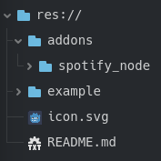
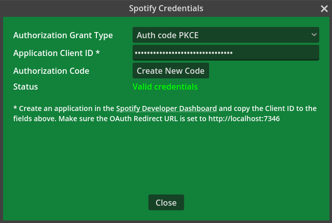
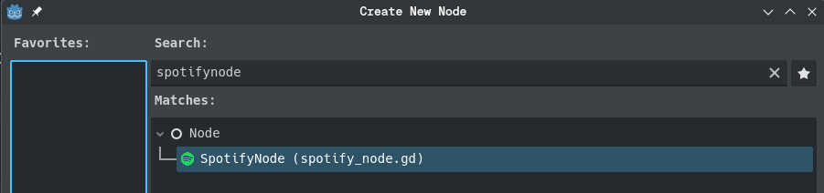

# SpotifyNode
A Godot addon for easy interfacing with Spotify from GDScript. 

## Features
- Provides GDScript signals for playback progress, pausing and track changes.
- Provides GDScript functions for getting playback info, play/pauze, next/previous, adding songs to the queue, getting queue and playlist info, changing volume, searching, getting user profile info, getting device info and setting credentials.
- Contains a credentials scene that can be (partly) reused in your own project, for easy generation of new access tokens using the authorization code flow or the authorization code PKCE flow. Launches a local http server to capture the token after redirect, so no copy-pasting needed by the user.
- No unencrypted tokens in variables. This makes the addon safe for streaming while developing and debugging
- Encrypted storage of client id and access codes in the project user directory
- Built in rate limiting to prevent you from getting into trouble when accidentally launching too many requests (NOT YET TESTED)

## Install
Clone the project or download the zip file. Copy the files and folders to your project folder. Make sure they are in the root directory of your project.

# TODO

## Getting started
The easiest way to get started is to use the provided auth window scene:

1) Register a new application in the [Spotify Developer Dashboard](https://developer.spotify.com/dashboard). If you want to use the SpotifyNode auth scene, make sure you set the Redirect URI to http://localhost:7346
2) Run the auth window scene (`addons/spotify_node/auth_window/spotify_auth_window.tscn`)

3) Choose the Authorization Grant Type.
    - If you are making a client-side application, or any application that doesn't only run on your own device, choose the "Auth code PKCE".
    - If you're making a server-side application running on your own server, you can also choose the "Auth code".
    If you're not sure which one to pick, choose "Auth code PKCE" (this doesn't require local storage of an application wide client secret and so is the more secure option).
4) Copy the client id of your application from the Spotify Developer Dashboard to the `Application Client ID` field
5) Click the `Create New Code` button next to `Authorization Code`. A browser tab will open, showing you info about the scope of the token. Click `Agree`.

The code is automatically picked up by the addon and saved in an encrypted file called spotify_credentials in the user directory of the project, it will automatically be retrieved when a SpotifyNode is ran. You can reuse (parts of) the auth window in your own programs to allow easy generation of access codes.
You can now start using the Spotify Web API services by adding a SpotifyNode node to your scene.

Alternatively, instead of using the auth window scene, you can call the set_credentials functions of SpotifyNode to set the authorization grant type, client id, client secret and authorization code. If the store parameter is set to true, it will save the credentials in an encrypted file in the project user directory and the credentials will automatically be retrieved on future executions.

## Use
You can use this addon by adding a SpotifyNode node to your scene. Make sure you only have one active SpotifyNode in your program at any time, to prevent unexpected behaviour.
Use the functions of the SpotifyNode to perform actions like adding items to the queue, starting/pauzing playback, etc. You can specify the device on which to trigger the action, or leave it empty to trigger the action on the active device. Spotify needs to be open on at least one device for the actions to work (you can't launch the spotify player remotely through the API).
To start tracking Spotify playback progress, call the start_tracking_playback_state function of the SpotifyNode. You can connect to the signals of the SpotifyNode to get called with track progress updates, pause events and track change events. 

See the music_player scene in the example folder for an example of how to use the SpotifyNode functionalities.

## License
This project is released under the MIT license by MathrimC (2024)
